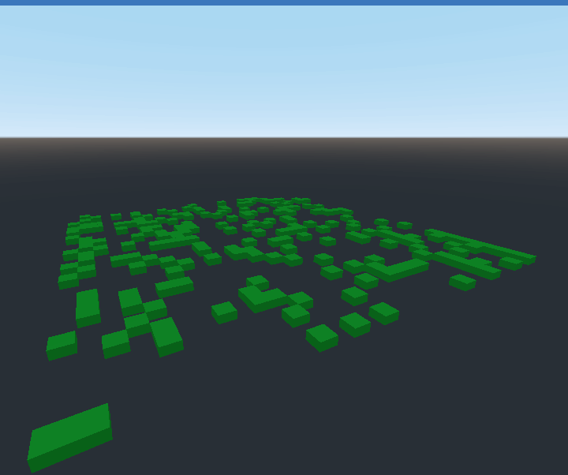

# Conways-Block-Universe
Godot implementation of Conway's Game of Life with the time dimension represented spatially

## Screenshots:

### Lighting:

### Rule Variations
#### - B2678/S34678

#### - B2/S

#### - B3/S012345678

#### - B3/S23

#### - B4678/S35678

### Generation and camera movement:

### Performance
#### - 1 Million cells

